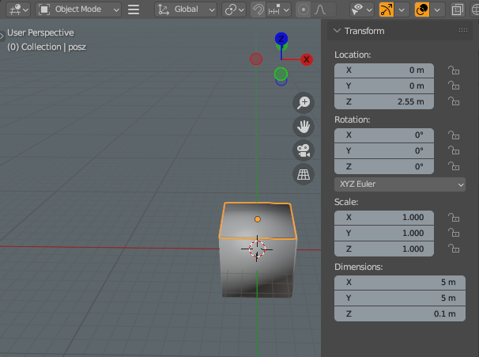
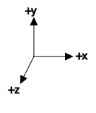
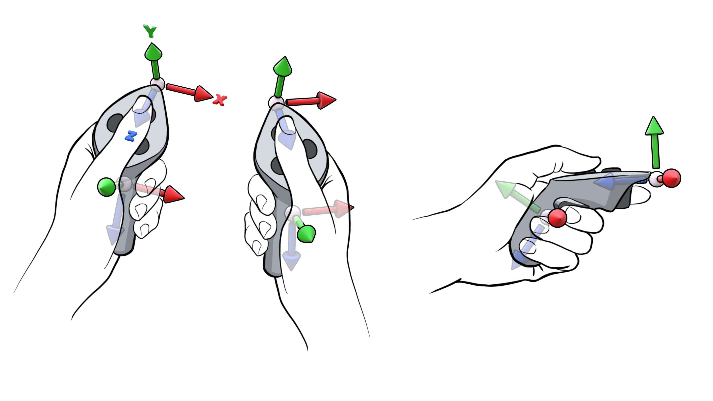

# Coordinates & Transformations

Back in the last tutorial, we saw how to load our objects from a series of .glb files into the world.  To provide more context, here is the full code for the function that snippet was a part of:

```rust,noplayground
fn add_skybox(models: &std::collections::HashMap<String, World>, world: &mut World) {
    let negx = add_model_to_world("negx", models, world, None);
    let posx = add_model_to_world("posx", models, world, None);
    let negy = add_model_to_world("negy", models, world, None).unwrap();
    let posy = add_model_to_world("posy", models, world, None).unwrap();    
    let negz = add_model_to_world("negz", models, world, None).unwrap();
    let posz = add_model_to_world("posz", models, world, None).unwrap();

    let rigid_posz = RigidBody {
		body_type: BodyType::Fixed,
		..Default::default()
    };

    let collider_posz = Collider::new(SharedShape::cuboid(2.5, 0.05, 2.5));
    
    world.insert_one(posz, rigid_posz);
    world.insert_one(posz, collider_posz);

    let rigid_negz = RigidBody {
		body_type: BodyType::Fixed,
		..Default::default()
    };

    let collider_negz = Collider::new(SharedShape::cuboid(2.5, 0.05, 2.5));

    world.insert_one(negz, rigid_negz);
    world.insert_one(negz, collider_negz);
    
    let bust = add_model_to_world("horned one", models, world, None).unwrap();
    {
		let mut local_transform = world.get::<&mut LocalTransform>(bust).unwrap();
		local_transform.translation.y = -1.5 ;
		local_transform.translation.x = 2.;
		local_transform.translation.z = 0.;
		local_transform.rotation = Quat::from_rotation_y(-90.0);
    }
	let collider = Collider::new(SharedShape::ball(0.15));
	world.insert(bust, (collider, Grabbable {})).unwrap();

    let photo_frame =  add_model_to_world("Photo Frame", models, world, None).unwrap();
    {
        let mut local_transform = world.get::<&mut LocalTransform>(photo_frame).unwrap();
        local_transform.translation.y = -1.5 ;
		local_transform.translation.x = 2.;
		local_transform.translation.z = 0.5;
		local_transform.rotation = Quat::from_rotation_y(-90.0);
    }

    let rigid_photo = RigidBody {
		body_type: BodyType::Dynamic,
		mass: 0.2,
		..Default::default()
    };

    let collider = Collider::new(SharedShape::cuboid(0.15, 0.15, 0.02));
    world.insert(photo_frame, (collider, Grabbable {}, RigidBody::default())).unwrap();
}
```

Here's what you'll see if you take a look at the source file in Blender:



As we discussed previously, Blender's Z axis is the same as Hotham and OpenXR's Y axis.  The coordinate system is outlined in the [OpenXR specification](https://registry.khronos.org/OpenXR/specs/1.0/html/xrspec.html#coordinate-system), and as you will see, positive Z moves toward the camera, while negative Z is into the screen.  Positive X is to your right, negative X to your left, and positive Y is the upward direction.



Consider the Blender file shown above.  The Z coordinate is 2.55 metres above the origin, and the object is 10 cm thick.  This means that its thickness spreads 5 cm above and below 2.55m, with the bottom of the cuboid touching Z=2.5m.  This is the 0.05 that you notice in the parameters passed to create the collider for the floor and ceiling. In 3D, objects are typically quantified with respect to a point of origin, with length width and breadth spreading out around that centre. Thus, a cuboid is specified by its half-widths (2.5 and 0.05 in the above example), and a ball shape is defined by its radius.

In an ideal world, you might expect to load up a scene like this and find yourself in the middle of the room floating in space, at the origin, looking at the centre of the wall.  In practice, this is not what happens.

When you boot up your headset, initially you are at the origin of what is called the *globally oriented stage*.  You are at the centre of your Guardian.  As you walk about, your translation from the centre of your Guardian changes.  However, the position of the head mounted display is *above the floor*.  If you:
```rust,noplayground
println!(engine.world.get::<&mut LocalTransform>(engine.hmd_entity).unwrap())
```

You will find that the translation of the hmd above the origin varies as you move your head left, right, up and down, as does the rotation.  Typically if you are sitting down, and you are of average height, the display will be between 60-70cm off the floor.

If you examine `src/engine.rs` in the crate, you will find this code within `engine.update()`:

```rust,noplayground
                // Since the HMD is parented to the Stage, its LocalTransform (ie. its transform with respect to the parent)
                // is equal to its pose in stage space.
                let hmd_in_stage = self.input_context.hmd.hmd_in_stage();
                let mut transform = self
                    .world
                    .get::<&mut LocalTransform>(self.hmd_entity)
                    .unwrap();
                transform.update_from_affine(&hmd_in_stage);
```

The position of the head mounted display is obtained from OpenXR itself, and it is treated just like any other input device.  If you have head tracking enabled in your app and you walk around, your view (including your translation and rotation) changes. Moreover, the value returned by the input context is entirely independent of any global transform you might set on the stage entity.

# Transformations

Lets look a little closer at the engine setup:

```rust,noplayground
fn create_tracking_entities(world: &mut hecs::World) -> (hecs::Entity, hecs::Entity) {
    let stage_entity = world.spawn((
        Stage {},
        LocalTransform::default(),
        GlobalTransform::default(),
    ));
    let hmd_entity = world.spawn((
        HMD {},
        Parent(stage_entity),
        LocalTransform::default(),
        GlobalTransform::default(),
    ));
    (stage_entity, hmd_entity)
}
```

Notice how the head mounted display mentioned earlier is a child of the stage object. The implication of this for navigation is spelled out in the documentation for the stage component.

*"In short, the final position of the player in the game simulation (ie. global space) is: `stage.position * hmd.position`  **You** are responsible for controlling the `Stage`, and the **engine** will update the `HMD`."*

Why is this so important?  Take a look at the implementation of Mul for two Affine transformations.

```rust,noplayground
impl Mul for Affine3A {
    type Output = Affine3A;

    #[inline]
    fn mul(self, rhs: Affine3A) -> Self::Output {
        Self {
            matrix3: self.matrix3 * rhs.matrix3,
            translation: self.matrix3 * rhs.translation + self.translation,
        }
    }
}
```

You'll notice that the rotation of the parent system, which is part of the 3x3 matrix of the affine self (on the lhs), gets multiplied by the translation of the local system on the rhs, before adding its translation to the final result.  Scale and rotation are applied first, then translation.

A `LocalTransform` is simply multiplied by the parent transform like the following code from `update_global_transform_recursively` in `update_global_transform_with_parent`:

```rust,noplayground
            {
                let child_matrix = &mut world.get::<&mut GlobalTransform>(*child).unwrap().0;
                *child_matrix = *parent_matrix * *child_matrix;
            }
```

**This means that if I get up and move away from the origin of my guardian, and then rotate the stage about its own origin, I will rotate on a circle around the stage object's global translation, with the radius of that circle being my headset's translation from the origin of the guardian.**

If you are not careful in considering the parenting of objects, you can end up describing circles within circles, and getting quite confused. At first, this seems counter intuitive, until you understand the larger picture. A visual aid is helpful. Intuitively, it is easy in your head to reverse the order of rotation and translation occuring, because we normally visualise rotation occuring along a radius which we conflate with the translation.  But this would be an incorrect interpretation of the situation.

Instead, you should picture all child objects of some parent (such as the head mounted display) as being *oriented* with respect to their parent space, with an *origin* being determined by the parent's translation. Scale spreads out uniformly from this translation point, and then the child is translated, with all axes having been rotated around the origin by the parent's rotation and scaled accordingly. Spend some time getting comfortable with this image, because it will serve you well when figuring out more complicated situations. Meditate on it, run the transformation forward and backward in your mind.

See the additional arcs of rotation occurring, but the translation point remaining unchanged.  See the child, translated with respect to that rotation, moving by degrees around a circle, running in the same direction up left and right each time, but its up left and right are constrained, as if it is being moved through toffee or better yet, through a magnetic field.

We see this type of relative motion in nature with physical frames of reference such as a planet, a solar system, a galaxy.  If you imagine your transformations in this way, you won't get confused.

# Summary of methods

To adjust the position of an object, we usually query it's `LocalTransform` like this from the example above:

```rust,noplayground
		let mut local_transform = world.get::<&mut LocalTransform>(bust).unwrap();
```

We then call the implementation functions on that borrowed memory or set the fields within the borrowed struct to adjust the transformation like this:

```rust,noplayground
		local_transform.translation.y = -1.5 ;
		local_transform.translation.x = 2.;
		local_transform.translation.z = 0.;
		local_transform.rotation = Quat::from_rotation_y(-90.0);
```

or, like this example which borrows the world in its struct's construction:

```rust,noplayground
    pub fn set_affine(&self, entity: &Entity, affine: Affine3A) {
	let mut local_trans = self.world.get::<&mut LocalTransform>(*entity).unwrap();
	local_trans.update_from_affine(&affine);
}
```

If an object has a parent, we always use the LocalTransform.  The GlobalTransform is useful in getting the position in global space.

# GOS and Global from Stage

If you read through the example code in the Hotham crate, you may come across terms such as `gos_from_stage`, `global_from_stage`,
`global_from_stage`, and `gos_from_global`.  These are multiplied together and can look overwhelming at first glance, but here's an explanation:

* `stage::global_from_stage(&world)` gets the `GlobalTransform` of the `stage_entity`
* `gos_from_global` is often the inverse of the translation taken from this global transform, ignoring rotation.
* `gos_from_stage` is `gos_from_global * global_from_stage`. This changes the `GlobalTransform` of the stage object to remove the translation.

These terms are used in order to transform everything into global coordinates without affecting their orientation.  This is used, for instance, 
in computing the real world positions of all objects with respect to global space for the shader in the rendering code.

Removing translation while allowing rotation is useful when you don't care about an objects orientation and only care about the position of
objects with respect to one another.  This `gos_from_global` transformation is used in conjunction with their `GlobalTransform` to prepare a 
series of objects for scaling and rotation.


These explanations can remain abstract without an example, so lets look at the navigation system code from the hotham examples.

```rust,noplayground
    // Get the stage transform.
    let mut stage_transform = world.get::<&mut LocalTransform>(stage_entity).unwrap();
    let global_from_stage = stage_transform.to_affine();

    // Get the hand transforms.
    let stage_from_left_grip = input_context.left.stage_from_grip();
    let stage_from_right_grip = input_context.right.stage_from_grip();

    // Update grip states.
    if input_context.left.grip_button_just_pressed() {
        state.global_from_left_grip = Some(global_from_stage * stage_from_left_grip);
    }
    if input_context.right.grip_button_just_pressed() {
        state.global_from_right_grip = Some(global_from_stage * stage_from_right_grip);
    }
    if input_context.right.grip_button() && input_context.left.grip_button_just_released() {
        // Handle when going from two grips to one
        state.global_from_right_grip = Some(global_from_stage * stage_from_right_grip);
    }
    if !input_context.left.grip_button() {
        state.global_from_left_grip = None;
        state.scale = None;
    }
    if !input_context.right.grip_button() {
        state.global_from_right_grip = None;
    }
```

In this first snippet, the positions of the left and right grip returned from OpenXR are transformed using the `LocalTransform` of the stage object.  This puts them into stage space.  The remaining logic handles ensuring the stored transforms of these grips within stage space remain consistent.  Note that although `GlobalTransform` and `LocalTransform` should be consistent at the start of a frame after the appropriate systems have run, `LocalTransform` is being used here in case it has been updated during this frame, as the navigation system runs before `update_global_transform_system` and `update_global_transform_with_parent_system`.  When these two systems run after the navigation system, any changes made by this code are updated on the relevant objects so the rendering of the frame can occur.

The real magic happens in the next snippet. For brevity we will only examine the final code block matched by the condition that both left and right grip values have been stored.

```rust,noplayground
        (Some(global_from_stored_left_grip), Some(global_from_stored_right_grip), _) => {
            // Gripping with both hands allows scaling the scene
            // The first hand acts as an anchor and the second hand only scales the scene.
            let stored_left_grip_in_global = global_from_stored_left_grip.translation;
            let stored_right_grip_in_global = global_from_stored_right_grip.translation;
            let left_grip_in_stage = stage_from_left_grip.translation;
            let right_grip_in_stage = stage_from_right_grip.translation;

            let unscaled_global_from_stage =
                global_from_stored_left_grip * stage_from_left_grip.inverse();
            let left_grip_in_unscaled_global =
                unscaled_global_from_stage.transform_point3a(left_grip_in_stage);
            let right_grip_in_unscaled_global =
                unscaled_global_from_stage.transform_point3a(right_grip_in_stage);
            let stored_dist_in_global =
                stored_left_grip_in_global.distance(stored_right_grip_in_global);
            let dist_in_unscaled_global =
                left_grip_in_unscaled_global.distance(right_grip_in_unscaled_global);
            let scale = stored_dist_in_global / dist_in_unscaled_global;

            // Remember scale for when one grip gets released.
            state.scale = Some(scale);

            // Let left hand be dominant for now.
            let stored_left_grip_from_left_grip =
                Affine3A::from_scale(Vec3::new(scale, scale, scale));

            stage_transform.update_from_affine(
                &(global_from_stored_left_grip
                    * stored_left_grip_from_left_grip
                    * stage_from_left_grip.inverse()),
            );
        }
```

The easiest part of this code to understand is the setting of the scale factor.  Recall in the first snippet, `stage_from_left_grip` and `stage_from_right_grip` (the raw positions given by OpenXR) were multiplied by a matrix on the left hand side representing the transform of the stage before being stored in the state variable.  This implies that in the transform of the stage, there may be a scale factor already applied, as well as a rotation.  The translation component of these two stored and transformed grips will have a distance between them in stage space. This distance is given by the `lhs.distance(rhs)` function pattern, which computes the length of the vector which is the difference between two.

But why does this code compute the `unscaled_global_from_stage` transformation as `global_from_stored_left_grip * stage_from_left_grip.inverse()`?  Recall that `global_from_stored_left_grip` is taken from the stored value `global_from_stage * stage_from_left_grip`, which is stored just once when the grip button is first pressed.  This stores the rotation, translation and scale of the controller at the time of the grip in relation to stage space, to use "as an anchor".  Multiplying this by the inverse of the current left grip removes the rotation and translation of the left grip (it has no scale) and gives a kind of global anchor of scale, translation and rotation at the time the button was pressed, offset by however much the user has rotated or moved the left grip since. This allows the scene to be rotated or translated using a single grip alone, while the scale is calculated from the distance between the hands.

By then transforming the left and right grips current translation into that original coordinate system, and then dividing that by the original distance between the stored left and right grips, a scaled factor can be maintained and constructed.

The final line of this code block:

```rust,noplayground
            stage_transform.update_from_affine(
                &(global_from_stored_left_grip
                    * stored_left_grip_from_left_grip
                    * stage_from_left_grip.inverse()),
            );
```

simply multiplies the original stored global left grip by an affine scaling the scene in all three directions by this calculated scale factor.  It then cancels out the original orientation and translation of the controller by multiplying by the inverse, leaving only the differential compensation.

Notice how the inverse matrix is on the right hand side of the multiplication. Let's call the original transformation of the controller T. If the controller does not move or rotate, T.T<sup>-1</sup> = the identity matrix.  Recall that the stored grip is the stage transformation matrix S multiplied by T, thus S.T.T<sup>-1</sup> = S.

Suppose that the controller rotates or moves by an amount quantified by the transformation U. We can quantify this new controller position as T' = T.U

Multiplying the original stage transform S by the original controller transformation T, then multiplying this by the inverse of T', we get S.T.T'<sup>-1</sup> = S.T.T<sup>-1</sup>.U<sup>-1</sup> = S.U<sup>-1</sup>

You might think this would end up turning the model in the opposite direction to what was intended, as application of the inverse of U rotates or translates in the opposite direction.  I will leave it as an exercise for you to determine how the definition how the nature of the definition of the grip axes in the OpenXR specification causes this unexpected result.



If an object has a rigid body, its position is controlled by the physics simulation and should not be set manually.  We will touch on the physics simulation next.
